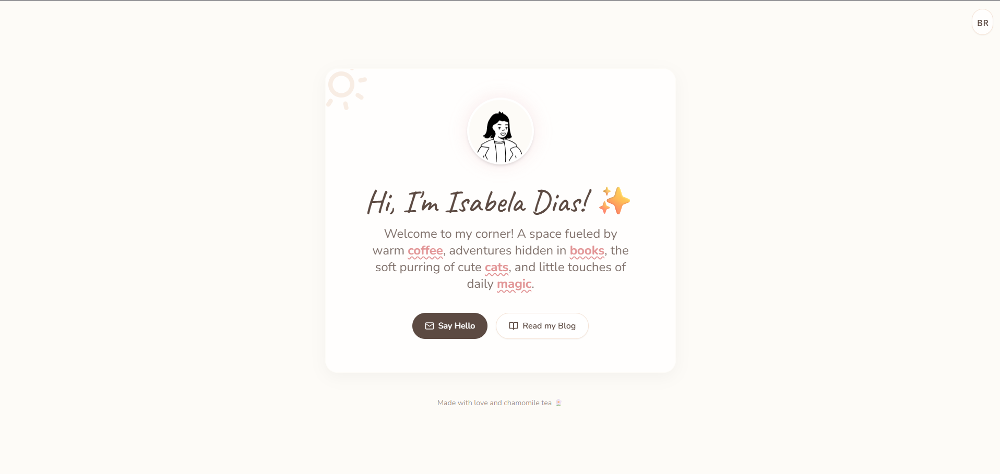
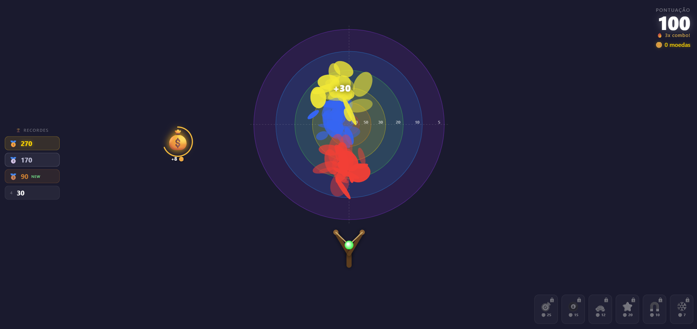

# 🧪 Web Development Study Laboratory ✨

Welcome to my Study Laboratory! 🚀

This repository is a continuous learning sandbox dedicated to exploring web development, testing new concepts, and building fun experiments.

While it serves as a general playground for coding, a significant focus right now is on Artificial Intelligence. I am currently exploring how Large Language Models (LLMs) can assist in development through prompting, and I plan to integrate AI APIs into future projects.

> **Note:** The initial versions of the projects below were built 100% using AI prompts relying on HTML, CSS, and Vanilla JavaScript. However, as the laboratory evolves, manual coding, architectural changes, and new tools will be naturally introduced!

## 🛠️ Tech Stack & Tools

- HTML
- CSS
- Vanilla JavaScript
- AI-powered development (Google Gemini, Anthropic Claude)

## 📂 Current Projects

These projects are in constant development and iteration. Here is what is currently brewing in the lab:

### 1. 🎨 Personal Website

A clean and beautiful personal portfolio website.

- **Initial Prompting:** Google Gemini ✨
- **Technologies:** HTML, CSS, JavaScript
- **Status:** Active Development 🔄

**Screenshot:**



### 2. 🎯 Slingshot Game

A fun, physics-based slingshot web game playable right in the browser.

- **Initial Prompting:** Anthropic Claude 🤖
- **Technologies:** HTML, CSS, JavaScript
- **Status:** Active Development 🔄

**Screenshot:**



## 🚀 How to Run

Currently, the projects are kept as simple, standalone HTML files. Running them is very straightforward!

1. Clone this repository:

   ```bash
   git clone https://github.com/your-username/your-repo-name.git
   ```

2. Open the project files directly in your favorite web browser:

   - **`index.html`** — Personal website (home / hub)
   - **`slingshot/index.html`** — Slingshot game

That's it! 🎈

---

Made with curiosity, continuous learning, and a little bit of magic 🪄